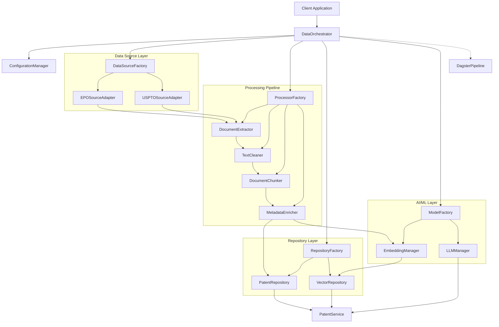

# Clean Architecture Recommendations for Your LangChain Project

Based on your codebase, I'll outline recommendations to make your project more modular and flexible, allowing you to easily swap databases, models, and embeddings without significant code changes. I'll focus on architectural patterns rather than specific code changes.

## Core Architectural Principles to Implement

### 1. Dependency Inversion Principle

**What**: Define interfaces/abstract classes for your components and depend on these abstractions, not concrete implementations.

**Why**: This allows you to swap implementations without changing dependent code. For example, changing from ChromaDB to Pinecone would require implementing a new vector store adapter without changing your retrieval logic.

**Example**: Create a `VectorStore` abstract class that defines methods like `add_documents()`, `search()`, with concrete implementations for ChromaDB, Pinecone, etc.

### 2. Strategy Pattern for Swappable Components

**What**: Encapsulate families of algorithms (embedding models, LLMs) behind consistent interfaces, making them interchangeable.

**Why**: When you want to try a new embedding model or LLM, you simply create a new strategy implementation rather than modifying existing code.

**Example**: Create `EmbeddingStrategy` interface with implementations like `HuggingFaceEmbedding`, `OpenAIEmbedding`, etc.

### 3. Factory Pattern for Component Creation

**What**: Use factories to create complex objects based on configuration.

**Why**: Centralizes creation logic and allows runtime selection of implementations.

**Example**: `LLMFactory` that creates the appropriate LLM instance based on configuration settings.

## Implementation Roadmap (By Priority)

### Phase 1: Configuration System Refactoring

Your configuration system is already good but could be improved:

1. **Create a unified configuration manager:**
   - Create a centralized `ConfigManager` class that loads all configurations
   - Support environment overrides for all settings
   - Add validation for configurations

2. **Separate configuration from implementation:**
   - Ensure all component configuration is in YAML files
   - Remove any hardcoded settings from implementation classes

**Benefits**: This will make your components more configurable and provide a foundation for abstraction.

### Phase 2: Define Core Interfaces

Define the key interfaces that will allow component swapping:

1. **Vector Database Interface:**
```
VectorDatabaseInterface
├── add_documents()
├── search()
├── delete()
└── get_collection()
```

2. **Embedding Model Interface:**
```
EmbeddingModelInterface
├── embed_query()
├── embed_documents()
└── get_dimension()
```

3. **LLM Interface:**
```
LLMInterface
├── generate()
├── get_model_name()
└── stream()
```

**Benefits**: These interfaces will serve as contracts between your application and specific implementations, allowing easy swapping.

### Phase 3: Implement Repository Pattern

1. **Create repository classes for data access:**
   - `PatentRepository` that abstracts how patent data is stored and retrieved
   - `VectorStoreRepository` that handles all vector database operations

2. **Example repository interface:**
```
PatentRepository
├── get_by_id()
├── search_by_criteria()
├── save()
└── get_all()
```

**Benefits**: Repositories abstract your data storage, making it easier to change databases or add caching.

### Phase 4: Factory and Service Classes

1. **Create factories for component creation:**
   - `LLMFactory` for creating language models
   - `EmbeddingFactory` for creating embedding models
   - `VectorDBFactory` for creating vector databases

2. **Create service classes for business logic:**
   - `PatentClaimGenerationService` 
   - `PatentSearchService`
   - `DocumentChunkingService`

**Benefits**: Factories centralize object creation logic, while services organize business logic independently from data access.

### Phase 5: Dependency Injection Container

1. **Implement a simple DI container:**
   - Register components by interface
   - Resolve dependencies at runtime
   - Support scoped lifetimes (singleton, transient)

2. **Example usage:**
```
container.register(VectorDatabaseInterface, ChromaDBAdapter)
container.register(EmbeddingModelInterface, HuggingFaceEmbedding)
```

**Benefits**: A DI container makes dependencies explicit and simplifies component swapping.

## Specific Component Recommendations

### Vector Database Abstraction

1. **Create a database adapter layer:**
   - Create adapters for ChromaDB, Pinecone, etc.
   - Implement consistent document handling across adapters
   - Standardize metadata handling

2. **Add database-specific extensions:**
   - Create extension methods for database-specific features
   - Keep core interface minimal and compatible

### Embedding Models Abstraction

1. **Create wrappers for different embedding providers:**
   - Implement consistent interface for HuggingFace, OpenAI embeddings
   - Handle caching consistently across implementations
   - Abstract dimension differences

2. **Add embedding combination strategies:**
   - Support multiple embedding models simultaneously
   - Support for ensemble methods

### LLM Provider Abstraction

1. **Create provider-agnostic interfaces:**
   - Abstract away provider-specific parameters
   - Standardize response formatting
   - Create consistent error handling

2. **Implement chain orchestration interfaces:**
   - Make chains provider-agnostic
   - Support model fallbacks

## Quality Assurance Improvements

1. **Interface-based unit testing:**
   - Test against interfaces rather than implementations
   - Use mocks for dependencies
   - Create test fixtures for each component type

2. **Contract testing:**
   - Define expected behavior for each interface
   - Test all implementations against these contracts
   - Automate compatibility testing

3. **Configuration testing:**
   - Validate configurations against schema
   - Test loading from various sources

## Implementation Order

I recommend this order for implementation:

1. **Start with configuration system** - This gives you flexibility from the start
2. **Define core interfaces** - Establish your contracts before implementations
3. **Create repository pattern** - Abstract data access
4. **Implement factories** - Make component creation configurable
5. **Refactor specific components** - Begin with database adapters
6. **Add service layer** - Organize business logic
7. **Implement dependency injection** - Wire everything together
8. **Enhance error handling** - Make system resilient to component failures
9. **Improve testing** - Ensure components are interchangeable

## Conclusion

These architectural changes will make your system more flexible without changing its core functionality. By focusing on abstractions first, you'll create a system where components can be easily swapped without cascade changes throughout your codebase.

The most important principle is separation of concerns - keep your business logic independent from specific implementations. With these changes, you'll be able to experiment with different vector databases, embedding models, and LLMs while maintaining a consistent API for your application.


# Data Source Abstraction Architecture for Patent Processing

After analyzing your codebase, I can see you have separate implementations for EPO and USPTO patent data processing. Let's design a clean architecture that separates concerns for data sources while minimizing code duplication.

## Core Data Pipeline Abstraction

### 1. Data Source Abstraction Layer

**What to implement:**
- Create a unified `PatentDataSource` interface that all data sources implement
- Define standard methods for extraction and parsing
- Separate format-specific logic from general processing logic

**Interface structure:**
```
PatentDataSource
├── extract_raw_data()      # Gets data from source (zip, web, etc.)
├── parse_to_standard_format() # Converts to internal format
└── get_metadata_schema()   # Describes the metadata structure
```

**Benefits:**
- Add new patent sources (WIPO, JPO, etc.) by implementing the interface
- Process logic doesn't need to know data source details
- Test different sources independently

### 2. Format Transformation Layer

**What to implement:**
- Create a `DocumentStandardizer` that converts all source-specific formats to one standard format
- Implement format-specific adapters (XML, JSON, TXT)
- Define a standard internal document representation

**Design approach:**
- Use Adapter pattern to handle different input formats
- Create a unified document model with required/optional fields
- Validators for ensuring data quality

**Benefits:**
- Source-specific code limited to adapter classes
- Downstream processing works with standardized documents
- Easier to add new formats

### 3. Document Processing Pipeline

**What to implement:**
- Create a processing pipeline with pluggable components
- Define standard interfaces for processors (chunkers, cleaners, etc.)
- Use composition over inheritance

**Pipeline structure:**
```
DocumentProcessor
├── Filters (remove unwanted content)
├── Cleaners (normalize text, remove artifacts)
├── Chunkers (split documents strategically)
├── Transformers (add metadata, structure)
└── Validators (ensure quality)
```

**Benefits:**
- Configure different pipelines for different needs
- Reuse components across sources
- Test each component independently

## Implementation Strategy

### 1. Start with Data Models

Define your domain models first:
- `Patent` (core domain entity)
- `PatentMetadata` (standardized across sources)
- `PatentContent` (sections, claims, abstract)
- `ProcessingResult` (tracking processing outcomes)

These models should be source-agnostic and represent your unified view of patents.

### 2. Create Source Adapters

For each data source:
- Implement a specific `EPOSourceAdapter`, `USPTOSourceAdapter`
- Handle source-specific extraction logic
- Convert to your standard models
- Encapsulate all source-specific code

### 3. Build Processing Components

Create reusable processors:
- `TextCleaner` - normalize text regardless of source
- `DocumentChunker` - intelligent chunking strategies
- `MetadataEnhancer` - enrich with computed fields

### 4. Factory Pattern for Configuration

Use factories to:
- Create appropriate source adapters based on configuration
- Configure processing pipelines for different scenarios
- Select appropriate embedding strategies

## Practical Example Workflow

For any source (EPO/USPTO), the workflow becomes:

1. **Source Selection** - Factory creates appropriate adapter
2. **Data Extraction** - Source-specific adapter gets raw data
3. **Format Conversion** - Convert to standard model
4. **Processing Pipeline** - Run standard processors 
5. **Embedding/Storage** - Process using standard interfaces

## Reducing Code Duplication

Specifically for your EPO and USPTO code:

1. **Standardize Directory Structure** - Use the same structure for all sources
2. **Abstract XML/JSON Handling** - Create common utilities for parsing
3. **Unified Metadata Extraction** - Extract common fields in shared code
4. **Shared Text Processing** - Use the same cleaning/normalization functions
5. **Common Configuration System** - Configure all sources consistently

## Implementation Order

1. Start with your standardized document model
2. Implement the source abstraction layer
3. Create the first adapter (EPO)
4. Build the processing pipeline  
5. Add the second adapter (USPTO)
6. Refine shared components

This architecture allows you to add new patent data sources with minimal code, standardizes processing across sources, and maintains separation of concerns while reducing duplication.


# Patent Data Processing Architecture

## 📊 Architecture Flow Diagram



## 🧰 Core Components

### 1. Management & Orchestration

| Component | Description | Responsibility |
|-----------|-------------|----------------|
| `ConfigurationManager` | Centralized configuration system | Loads settings from YAML/env, validates configurations |
| `DataOrchestrator` | Main pipeline coordinator | Coordinates complete data flow from source to storage |
| `LoggingManager` | Centralized logging | Handles structured logging across all components |
| `ErrorManager` | Error handling | Standardizes error handling and recovery strategies |

### 2. Data Source Components

| Component | Description | Responsibility |
|-----------|-------------|----------------|
| `DataSourceFactory` | Creates appropriate source adapters | Returns correct adapter based on configuration |
| `PatentDataSource` (interface) | Abstract data source | Defines contract for all patent data sources |
| `EPOSourceAdapter` | EPO-specific data extraction | Handles EPO-specific formats and protocols |
| `USPTOSourceAdapter` | USPTO-specific data extraction | Handles USPTO-specific formats and protocols |
| `RawPatentValidator` | Validates raw patent data | Ensures minimum data quality before processing |

### 3. Processing Pipeline

| Component | Description | Responsibility |
|-----------|-------------|----------------|
| `ProcessorFactory` | Creates processing components | Configures processors based on data source |
| `DocumentExtractor` | Extracts structured data | Converts raw patent data to structured documents |
| `DocumentStandardizer` | Format normalization | Creates unified document format from source-specific formats |
| `TextCleaner` | Text normalization | Removes artifacts, normalizes text |
| `DocumentChunker` | Splits documents | Creates optimal chunks for embedding |
| `MetadataEnricher` | Enhances metadata | Adds computed fields, normalizes metadata |

### 4. Repository Layer

| Component | Description | Responsibility |
|-----------|-------------|----------------|
| `RepositoryFactory` | Creates data repositories | Returns appropriate repository implementations |
| `PatentRepository` | Patent data storage | Handles CRUD operations for patent documents |
| `VectorRepository` | Vector embedding storage | Manages vector embeddings and similarity search |
| `CacheManager` | Manages caching | Provides caching strategies for repositories |

### 5. AI/ML Components

| Component | Description | Responsibility |
|-----------|-------------|----------------|
| `ModelFactory` | Creates AI model interfaces | Returns configured model implementations |
| `EmbeddingManager` | Manages embedding models | Handles document embedding with configurable models |
| `LLMManager` | Manages language models | Provides unified interface to various LLMs |
| `PromptManager` | Manages prompt templates | Loads and renders prompt templates |

### 6. Service Layer

| Component | Description | Responsibility |
|-----------|-------------|----------------|
| `PatentService` | Business logic for patents | Provides high-level patent operations |
| `SearchService` | Search functionality | Handles semantic and keyword search |
| `GenerationService` | Text generation | Handles claim generation and other LLM tasks |

## 🔄 Data Flow

1. **Extraction Flow**:
   - `DataOrchestrator` requests data from `DataSourceFactory`
   - Appropriate `PatentDataSource` implementation extracts raw data
   - `RawPatentValidator` validates minimum data quality
   - Data flows to processing pipeline

2. **Processing Flow**:
   - `DocumentExtractor` extracts structured content
   - `DocumentStandardizer` normalizes to standard format
   - `TextCleaner` normalizes text content
   - `DocumentChunker` splits into optimal chunks
   - `MetadataEnricher` enhances with computed fields

3. **Storage Flow**:
   - `PatentRepository` stores document content and metadata
   - `EmbeddingManager` generates embeddings
   - `VectorRepository` stores vector embeddings

4. **Retrieval Flow**:
   - `SearchService` handles search requests
   - `VectorRepository` performs similarity search
   - `PatentRepository` retrieves full documents
   - Results combined and returned

5. **Generation Flow**:
   - `SearchService` retrieves relevant contexts
   - `PromptManager` renders appropriate templates
   - `LLMManager` generates responses
   - `GenerationService` processes and returns results

## 🔄 Dagster Integration Points

| Dagster Component | Corresponding Architecture Component | Purpose |
|-------------------|--------------------------------------|---------|
| **Assets** | Document models, Embeddings | Define data entities in Dagster |
| **Ops** | Processing Pipeline components | Individual processing steps |
| **Jobs** | Complete processing workflows | End-to-end flows |
| **Schedules** | Automated data updates | Regular data refreshes |
| **Sensors** | New data detection | Trigger processing on new data |
| **Resources** | Factories and Managers | Provide components to Dagster |

## 📁 Project Structure

```
langechain/
├── src/
│   ├── config/                # Configuration management
│   ├── models/                # Domain models and schemas
│   ├── adapters/              # Source-specific adapters
│   │   ├── epo/               # EPO-specific code
│   │   └── uspto/             # USPTO-specific code
│   ├── processors/            # Processing pipeline components
│   ├── repositories/          # Data storage components
│   ├── services/              # Business logic services
│   ├── ai/                    # AI/ML components
│   │   ├── embeddings/        # Embedding models
│   │   └── llm/               # Language models
│   └── utils/                 # Shared utilities
├── dagster/                   # Dagster pipelines
├── config/                    # Configuration files
└── notebooks/                 # Interactive notebooks
```